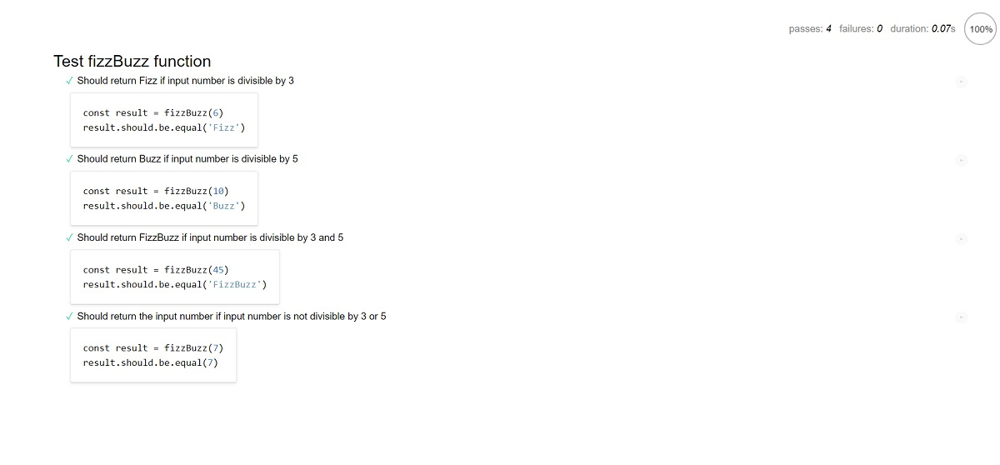

# FizzBuzz 測試練習
使用 mocha 測試框架實作出自動化測試，測試這個程式碼是否正確。  
[Github Page link](https://lianginger.github.io/fizzbuzz/)

## 截圖

## 測試規格
將一個大於 0 的整數傳到 fizzBuzz() 函式，並且該函式可以依下面的規則回傳結果。

若該整數能被 3 整除，回傳 Fizz；
若該整數能被 5 整除，回傳 Buzz；
若該整數能被 3 和 5 同時整除，回傳 FizzBuzz；
若都不能整除，回傳該整數。